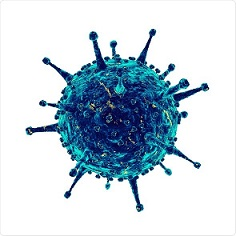

```{r setup, include=FALSE}
knitr::opts_chunk$set(echo = TRUE)
```

This is a summary generated from `Measuring Adaptive Distance and vaccine Efficacy using allelic barcodes (MADE)`.

MADE is a software developed to measure the strength of passage adaptation and predict the potential efficacy of a vaccine strain based on its nucleotide sequence . 

For more details go to: .

Advanced user refers to <https://github.com/chenh1gis/MADE>.

##Isolate

```{r include = FALSE}
#install.packages("hash")
#install.packages("beeswarm")
library(hash)
library(beeswarm)

Args <- commandArgs(trailingOnly = TRUE) 
Args[1]<-"MADE001";
made <- Args[1]
strain <- "NC0001";
def <- "influenza A H3N2 virus HA1 nucleotide sequence";
source <- "A/Philippines/2/1982(H3N2)";
host <- "human";
pass <- "egg passage";
comm <- "NA";
sub <- "Mike";
email <- "mike@gmail.com";
seq <- "CAAAAACTTCCTGGAAATGACAACAGCACGGCAACGCTGTGCCTTGGGCACCATGCAGTACCAAACGGAACGATAGTGAAAACAATCACGAATGACCAAATTGAAGT\nTACTAATGCTACTGAGCTGGTTCAGAATTCCTCAATAGGTGAAATATGCGACAGTCCTCATCAGATCCTTGATGGAGAAAACTGCACACTAATAGATGCTCTATTGGGAGAC\nCCTCAGTGTGATGGCTTCCAAAATAAGAAATGGGACCTTTTTGTTGAACGAAGCAAAGCCTACAGCAACTGTTACCCTTATGATGTGCCGGATTATGCCTCCCTTAG\nGTCACTAGTTGCCTCATCCGGCACACTGGAGTTTAACAATGAAAGCTTCAATTGGACTGGAGTCACTCAAAACGGAACAAGTTCTGCTTGCATAAGGAGATCTAATAAT\nAGTTTCTTTAGTAGATTAAATTGGTTGACCCAATTAAACTTCAAATACCCAGCATTGAACGTGACTATGCCAAACAATGAACAATTTGACAAATTGTACATTTGGGGGGTTC\nACCACCCGGTTACGGACAAGGACCAAATCTTCCTGTATGCTCAATCATCAGGAAGAATCACAGTATCTACCAAAAGAAGCCAACAAGCTGTAATCCCGAATATCGGATATA\nGACCCAGAATAAGGAATATCCCTAGCAGAATAAGCATCTATTGGACAATAGTAAAACCGGGAGACATACTTTTGATTAACAGCACAGGGAATCTAATTGCTCCTAGGGGTT\nACTTCAAAATACGAAGTGGGAAAAGCTCAATAATGAGATCAGATGCACCCATTGGCAAATGCAATTCTGAATGCATCACTCCAAATGGAAGCATTCCCAATGACAAACCATTC\nCAAAATGTAAACAGGATCACATACGGGGCCTGTCCCAGATATGTTAAGCAAAGCACTCTGAAATTGGCAACAGGAATGCGAAATGTACCAGAGAAACAAACTAGA";
AA <- "MPNNEQFDKLYIWGVHHPVTDKDQIFLYAQSSGRITVSTKRSQQAVIPNIGYRPRIRNIPSRISIYWTIVKPGDILLINSTGNLIAPRGYFKIRSGKSSIMRSDAPIGKCNSECITPNGS\nIPNDKPFQNVNRITYGACPRYVKQSTLKLATGMRNVPEKQTR"
date <- paste0(format(Sys.time(), "%a %b %d %X %Y"))
```

**MADE_ID : ** `r made`

**STRAIN_ID : ** `r strain`

**DEFINITION : ** `r def`

**SOURCE : ** `r source`

**HOST : ** `r host`

**PASSAGE : ** `r pass`

**COMMENTS : ** `r comm`

**SUBMITTER : ** `r sub`

**EMAIL : ** `r email`

**DATE : ** `r date`

## Sequence

**Nucleotide sequence aligned with the reference sequence : **

`r seq` 

**Nucleotide sequence translated into protein sequence : **

`r AA` 

## Results

Panels that describe the characterices of the candidate isolate are illustrated as following:

```{r echo = FALSE,fig.height = 20, fig.width = 18}
DAT=read.table("../Data/H3N2/H3N2_enrichment_scores_329codons", header=TRUE, sep="\t")
ALLE=read.table("Testdata/H3N2_14alleles.txt",header=TRUE,sep="\t")
ALLE[,2]<-sapply(ALLE[,2],as.character) 
H=hash()
for (i in 1:nrow(ALLE))
  .set(H,keys=ALLE[i,1],values=ALLE[i,2])

ALLELE = data.frame(AminoAcid=character(),Codon=integer(),OR=double(),IsCandidate=integer(),stringsAsFactors = FALSE)
CODON=c(138,145,156,158,159,160,183,186,190,193,194,219,226,246)
for (i in 1:nrow(DAT))
  if (DAT[i,1]==138 | DAT[i,1]==145 | DAT[i,1]==156 | DAT[i,1]==158 | DAT[i,1]==159 | DAT[i,1]==160 | DAT[i,1]==183 | DAT[i,1]==186 | DAT[i,1]==190 | DAT[i,1]==193 | DAT[i,1]==194 | DAT[i,1]==219 | DAT[i,1]==226 | DAT[i,1]==246)
  {
    row=nrow(ALLELE)+1
    ALLELE[row,1]<-as.character(DAT[i,2])
#    ALLELE[row,1]<-sapply(DAT[i,2],as.character) 
    ALLELE[row,2]<-DAT[i,1]
    ALLELE[row,3]<-DAT[i,3]
    if (values(H,as.character(ALLELE[row,2]))==ALLELE[row,1])
    {
      ALLELE[row,4]<-1
    }else
    {
      ALLELE[row,4]<-0
    }
  }
par(mfrow=c(3,2))

##################### beeswarm #######################################

boxplot(OR ~ Codon, data = ALLELE,boxwex=.6, main="Enrichment score across different codons",col="gray",ylab="Enrichment score",xlab="Codon position",cex.main=2.4,cex.lab=1.6,cex.axis=1.6)
beeswarm=beeswarm(OR ~ Codon, data = ALLELE, col="black", pch=19,cex=1.4,pwcol = 1 + as.numeric(IsCandidate),add=TRUE,position='center',corralWidth=0.2)

######################################################################

# DEMO=read.table("14alleles.txt", header=TRUE, sep="\t")
# OR=read.table("H3N2_enrichment_scores_329codons", header=TRUE, sep="\t")
GISAID=read.table("../Data/H3N2/H3N2_14alleles_background_strains", header=TRUE, sep="\t")
GISAID[,c(1,3)] <- sapply(GISAID[,c(1,3)],as.character) 
GISAID[nrow(GISAID) + 1,1:3] = c("TEST","NA","TEST")

DAT[,c(2)] <- sapply(DAT[,c(2)],as.character) 
CODON=c(138,145,156,158,159,160,183,186,190,193,194,219,226,246)
j=3
for(i in 1:14)
{
  j=j+1
  if (ALLE[which(ALLE$CODON==CODON[i]),2]!="NA")
  {
    if (DAT[which (DAT$Codon==CODON[i] & DAT$AminoAcid==ALLE[which(ALLE$CODON==CODON[i]),2]),3]!="NA")
    {GISAID[nrow(GISAID),j] = DAT[which(DAT$Codon==CODON[i] & DAT$AminoAcid==ALLE[which(ALLE$CODON==CODON[i]),2]),3]
    } else {stop(cat('The input of amino acid state over codon "',CODON[i],'" is not available in the list!\n', sep=''))}
  } else {stop(cat('The amino acid state over codon "',CODON[i],'" is missing in the input list!\n', sep=''))}
}
  
PCA <- princomp(GISAID[,4:17])
pc=c(1,2)
SCORE=PCA$scores
SCORE1=cbind(SCORE,GISAID$Passage)
SCORE=cbind(SCORE1,GISAID$Year)
colnames(SCORE)=c("PC1","PC2","PC3","PC4","PC5","PC6","PC7","PC8","PC9","PC10","PC11","PC12","PC13","PC14","PASSAGE","YEAR")

DIS = data.frame(Year=integer(),SpatialDistance=double())
#is.atomic(SCORE)
for (i in 2010:2016)
{
  PC1vacc=PC2vacc=0
  PC1bg=PC2bg=0
  dis=0
  VACCINE=SCORE[which(SCORE[,"YEAR"]==i & SCORE[,"PASSAGE"]=="EGG_VACCINE"),]
  BACKGROUND=SCORE[which(SCORE[,"YEAR"]==i & SCORE[,"PASSAGE"]!="EGG_VACCINE"),]
  for (j in 1:nrow(BACKGROUND))
    PC1bg=PC1bg+as.numeric(BACKGROUND[j,1])
    PC2bg=PC2bg+as.numeric(BACKGROUND[j,2])
  PC1bg=PC1bg/nrow(BACKGROUND)
  PC2bg=PC2bg/nrow(BACKGROUND)
  for (j in 1:nrow(VACCINE))
  {
    PC1vacc=as.numeric(VACCINE[j,1])
    PC2vacc=as.numeric(VACCINE[j,2])
    dis=dis+((PC1vacc - PC1bg)**2+(PC2vacc - PC2bg)**2)**0.5
  }
  dis=dis/nrow(VACCINE)
  DIS[nrow(DIS) + 1,1:2] = c(i,dis)
}

PC1test=PC2test=0
PC1bg=PC2bg=distT=0
TEST=SCORE[which(SCORE[,"PASSAGE"]=="TEST"),]
PC1test=as.numeric(TEST[1])
PC2test=as.numeric(TEST[2])
BACKGROUND=SCORE[which(SCORE[,"PASSAGE"]!="EGG_VACCINE" & SCORE[,"PASSAGE"]!="TEST"),]
for (j in 1:nrow(BACKGROUND))
  PC1bg=PC1bg+as.numeric(BACKGROUND[j,1])
  PC2bg=PC2bg+as.numeric(BACKGROUND[j,2])
PC1bg=PC1bg/nrow(BACKGROUND)
PC2bg=PC2bg/nrow(BACKGROUND)
disT=((PC1test - PC1bg)**2+(PC2test - PC2bg)**2)**0.5

############### PCA - all strains #################

minpc1=as.integer(min(as.integer(SCORE[,1]))-3)
minpc2=as.integer(min(as.integer(SCORE[,2]))-4)

num=array(0,dim=c(30,35))
for (i in 1:nrow(BACKGROUND))
  num[as.integer((as.numeric(BACKGROUND[i,1])-minpc1)/1),as.integer((as.numeric(BACKGROUND[i,2])-minpc2)/1)]=num[as.integer((as.numeric(BACKGROUND[i,1])-minpc1)/1),as.integer((as.numeric(BACKGROUND[i,2])-minpc2)/1)]+1

COUNT = data.frame(X=double(),Y=double(),Number=integer())
for (i in 1:30)
  for (j in 1:35)
    for (n in 1:num[i,j])
      COUNT[nrow(COUNT) + 1,1:3] = c(i*1+minpc1,j*1+minpc2,num[i,j])

smoothScatter(COUNT$X,COUNT$Y,colramp = colorRampPalette(c("cornflowerblue","slategray1","mistyrose", "pink","red")),pch="",xlab=paste0("PC", pc[1], " (", round(PCA$sdev[pc[1]]/sum(PCA$sdev)*100,0), "%)"), ylab=paste0("PC", pc[2], " (", round(PCA$sdev[pc[2]]/sum(PCA$sdev)*100,0), "%)"),main="Distribution of H3N2 HA1 sequences",cex.main=2.4,cex.lab=1.6,cex.axis=1.6)
points(x=PC1test,y=PC2test,pch=19,cex=1)
text(x=PC1test,y=PC2test-1,labels="vaccine strain", cex= 1.6, offset = 10)

############### PCA - egg strains #################

minpc1=as.integer(min(as.integer(SCORE[,1]))-3)
minpc2=as.integer(min(as.integer(SCORE[,2]))-4)

EGG=SCORE[which(SCORE[,"PASSAGE"]=="EGG"),]

num=array(0,dim=c(30,35))
for (i in 1:nrow(EGG))
  num[as.integer((as.numeric(EGG[i,1])-minpc1)/1),as.integer((as.numeric(EGG[i,2])-minpc2)/1)]=num[as.integer((as.numeric(EGG[i,1])-minpc1)/1),as.integer((as.numeric(EGG[i,2])-minpc2)/1)]+1

COUNT = data.frame(X=double(),Y=double(),Number=integer())
for (i in 1:30)
  for (j in 1:35)
    for (n in 1:num[i,j])
      COUNT[nrow(COUNT) + 1,1:3] = c(i*1+minpc1,j*1+minpc2,num[i,j])

smoothScatter(COUNT$X,COUNT$Y,colramp = colorRampPalette(c("cornflowerblue","slategray1","mistyrose", "pink","red")),pch="",xlab=paste0("PC", pc[1], " (", round(PCA$sdev[pc[1]]/sum(PCA$sdev)*100,0), "%)"), ylab=paste0("PC", pc[2], " (", round(PCA$sdev[pc[2]]/sum(PCA$sdev)*100,0), "%)"),main="Distribution of H3N2 HA1 sequences",cex.main=2.4,cex.lab=1.6,cex.axis=1.6)
points(x=PC1test,y=PC2test,pch=19,cex=1)
text(x=PC1test,y=PC2test-1,labels="vaccine strain", cex= 1.6, offset = 10)

############## Density ################

DISTANCE = data.frame(Year=integer(),Passage=character(),SpatialDistance=double(),stringsAsFactors = FALSE)
BACKGROUND=SCORE[(SCORE[,"PASSAGE"]=="EGG"),]
for (i in 1:nrow(BACKGROUND))
{
  PC1dis=as.numeric(BACKGROUND[i,1])
  PC2dis=as.numeric(BACKGROUND[i,2])
  dis=((PC1dis - PC1bg)**2+(PC2dis - PC2bg)**2)**0.5
  DISTANCE[nrow(DISTANCE) + 1,1:3] = suppressWarnings(c(as.integer(BACKGROUND[i,16]),as.character(BACKGROUND[i,15]),dis))
}

d <- density(as.numeric(DISTANCE$SpatialDistance))
plot(d, main="Distribution of adaptive distance from egg strains",xlab="Adaptive distance",cex.main=2.4,cex.lab=1.6,cex.axis=1.6)
polygon(d, col="cornflowerblue")
abline(v=disT,col='red',lwd=2) 

###################### Trajctories ##############

 par(mar=c(6, 5, 5, 4))
 ## Plot first set of data and draw its axis
 plot(DIS$Year[1:6], DIS$SpatialDistance[1:6], pch=19, axes=FALSE,  xlab="",  ylab="",type="b",col="black",cex.main=1.2,    main="Vaccine_Efficancy vs. Distance",ylim=c(0,30),cex.main=2.4)
 #abline(h=disT,col='red',lwd=2)
 axis(2, col="black",las=1,cex.axis=1.6)  ## las=1 makes horizontal labels
 mtext("Distance",side=2,line=2.5,cex=1.2)
 box()
 ## Allow a second plot on the same graph
 par(new=TRUE)
 VE=c(0.46,0.32,0.40,0.10,0.07,NA)
 YR=c("2010-2011","2011-2012","2012-2013","2013-2014","2014-2015","2015-2016")
 ## Plot the second plot and put axis scale on right
 plot(DIS$Year[1:6], VE, pch=15,  xlab="", ylab="", ylim=c(0,0.5), axes=FALSE, type="b", col="blue")
 ## a little farther out (line=4) to make room for labels
 mtext("Vaccine efficacy",side=4,col="black",line=4,cex=1.2) 
 axis(4, ylim=c(0,0.5), cex.axis=1.6, col="black",col.axis="black",las=1)
 ## Draw the time axis
 axis(1, 2010:2016,YR[1:7],cex.axis=1.6)
 #axis(1,YR)
 mtext("Year windows",side=1,col="black",line=2.5,cex=1.2)  
 ## Add Legend
 legend("topright",legend=c("Adaptive Distance","Vaccine_Efficacy","Prediction"),pch=c(19,15),col=c("black","blue","red"),cex=1.6)

############## scatterplot ###################

VE=c(0.46,0.32,0.40,0.10,0.07,NA)
lm = lm(VE ~ DIS$SpatialDistance[1:6])
lmsum = summary(lm)
plot(DIS$SpatialDistance[1:6], VE, pch = 16, type = 'p', las = 1,cex=1.2,
     xlab = 'Adaptive distance',
     ylab = '',
     main = "Correlation between adaptive distance and vaccine efficacy",
     cex.main=2.4,cex.lab=1.6,cex.axis=1.6
     )
abline(lmsum$coefficients[1:2],lwd=2)
r2 = lmsum$adj.r.squared
mylabel = bquote(italic(R)^2 == .(format(r2, digits = 3)))
text(x = 22, y = 0.45, cex=1.6,labels = mylabel)
veT = lmsum$coefficients[2,1]*disT + lmsum$coefficients[1,1]
points(x=disT,y=veT,pch=19,cex=1.6,col="red")
veT1=formatC(veT,digits=2, format="f")
veE=paste('VE = ',veT1,sep='')
text(x=disT+0.4,y=veT+0.015,labels=veE, cex= 1.6, offset = 10)
disT1=formatC(disT,digits=2, format="f") 
disE=paste('AD = ',disT1,sep='')
text(x=disT+0.4,y=veT+0.03,labels=disE, cex= 1.6, offset = 10)
nx=c(0,disT)
ny=c(veT,veT)
lines(nx,ny,lwd=1.5,lty=2,col="red")
nx=c(disT,disT)
ny=c(0,veT)
lines(nx,ny,lwd=1.5,lty=2,col="red")
```

Observation

## Summary

**Sequence relevant to this candidate isolate : **

**Adaptive distance of this candidate isolate : **

**Probability of historically passaged in egg : ** 

**Estimated vaccine efficacy of this candidate isolate : **

<div id="bg">
  
</div>
